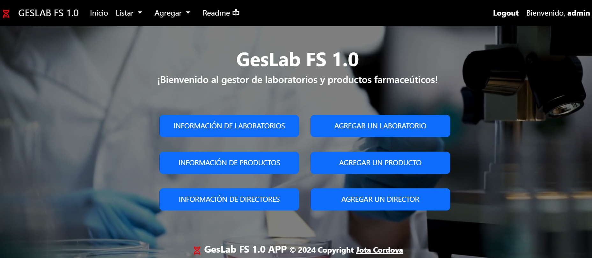

# Gestor de Laboratorios

## Descripción General

El Gestor de Laboratorios, GESLAB FS 1.0, es una aplicación web desarrollada usando el Framework Django y diseñada para llevar un  registro y control de instalaciones farmacéuticas, los productos que fabrica o produce, y de su representante o Director, posibilitando hacer gestión sobre los mismos.

## Características Principales

* **Gestión de laboratorios:** Permite listar, crear, editar y eliminar laboratorios, pudiendo agregarse nuevos campos de ser necesario.
* **Gestión de Productos Farmacéuticos:** Permite listar y la creación, edición y eliminación de productos. Cada producto sólo puede pertenecer a un Laboratorio.
* **Gestión de Directores:** Permite listar, crear, editar y eliminar Directores, pudiendo agregarse nuevos campos de ser necesario. cada Director, sólo puede pertenecer a un Laboratorio.
* **Gestión del Sistema (ADMIN):** El sistema permite crear perfiles de usuario, grupos, asignar permisos,  etc.
* **Reportes:** Se pueden generar los siguientes informes: Información por Laboratorio, Producto y Director.
* **Otras características:** El sistema incluye distintos métodos de búsqueda dinámicas y, a través de filtros con selectores.
* **Autenticación y Registros de Usurios:** El sistema dispone de un módulo para el registro y autenticación de usuarios, otorgando varios niveles de seguridad y segregación de la información.

## Tecnologías Utilizadas

* **Framework de Desarrollo:** Django 5.1.3.
* **Frontend:** HTML, CSS, JavaScript, Bootstrap.
* **Backend:** Python, Django.
* **Base de datos:** PostgreSQL v16.
* **Otras tecnologías:** Git, Github.

## Instalación y Configuración

1. **Clonar el repositorio:**

   ```bash
   https://github.com/jcordovaj/EvalM7.git
   ```

2. **Crear un entorno virtual:**

   * En Linux/macOS

   ```bash

   python -m venv venv_lab

   source venv_lab/bin/activate  
 
   ```

   * En Windows

   ```bash

   python -m venv venv_lab

   venv_lab\Scripts\activate 

   ```

3. **Instalar las dependencias:**

   ```bash

   pip install -r requirements.txt
   
   ```

4. **Configurar la base de datos:*

   * Crear usuario userdjango/userdjango

   ```sql

   CREATE ROLE userdjango WITH LOGIN
      SUPERUSER
      CREATEDB
      CREATEROLE
      INHERIT
      NOREPLICATION
      BYPASSRLS
    CONNECTION LIMIT -1
    PASSWORD 'userdjango';

   ```

   * Crear BBDD
  
   Nombre: db_final_orm
   Usuario: userdjango (superuser)
   pass: userdjango
   collation: Spanish_spain.1252

5. Ejecutar la aplicación

   ```bash

   python manage.py runserver
   Usa el código con precaución.

     ```

6. Administrador del Sistema

   Administrador = Admin
   Password = 123456

## Contribución (Things-To-Do)

Se puede contribuir con los problemas o nuevas ideas, por favor respetar el estilo de programación y no subir código basura. Puede utilizar: forking del repositorio, crear pull requests, etc. Toda contribución es bienvenida.

## Licencia

Proyecto con fines educativos, no protegido por licencias

## Autor

Jota Córdova - Fun Manager

* **Otros colaboradores**
  
  * Nelson Ramirez - Tutor
